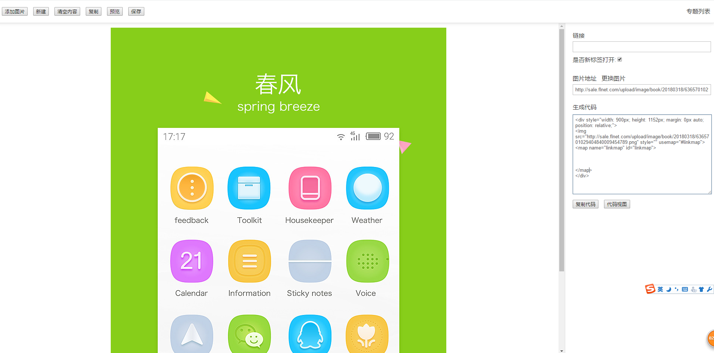
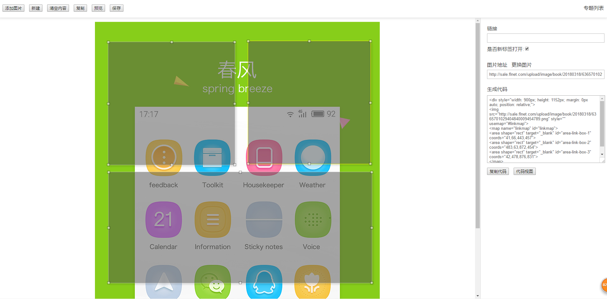
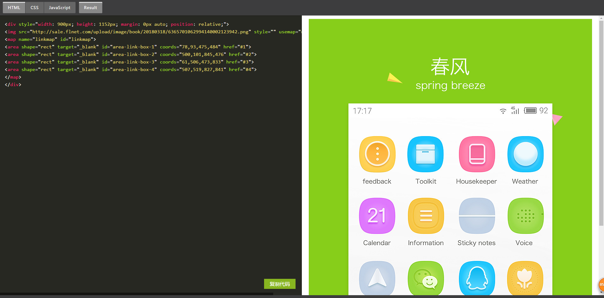

# vue-drawlink
> 线上访问地址 http://sale.flnet.com/drawlink/

> 如果对您有帮助，您可以点右上角 "Star" 支持一下 谢谢！ ^_^

> 基于vue 绘制图片热点的项目，工作中有些专题只需要图片绘制热点就可以，直接图片绘制热点简单方便。

---
##### 环境
 1. node >= 4.0.0
 2. npm >= 3.0.0


##### 技术栈

> [vue](https://github.com/vuejs/vue)

> [vue-resource](https://github.com/vuejs/vue-resource)

> [webpack](http://webpack.github.io/docs/)


> [es6-babel](https://babeljs.io/docs/learn-es2015/)

---
### 截图

---






---

### 安装
项目地址：（使用`git clone`）

```shell
git clone https://github.com/heqing0712/vue-drawlink.git
```

通过`npm`安装本地服务第三方依赖模块(需要已安装[Node.js](https://nodejs.org/))，使用npm安装依赖模块可能会很慢，建议换成[cnpm](http://cnpmjs.org/)

```shell
npm install -g cnpm --registry=http://registry.npm.taobao.org
```

```bash
# 安装依赖模块
cnpm install

# 启动服务
npm run dev

# 发布代码
npm run build

```

### 开发

### 目录结构
<pre>
.
├── README.md           
├── dist                     // 项目build目录
├── config                   // 环境变量和入口，出口配置
├── libs                     // 参与打包的插件类库
├── static                   // 静态资源目录
├── build                    // 项目的配置文件目录
│   ├── build.js             // 打包的主入口
│   ├── check-version.js     // 检查输出打包库的版本
│   ├── dev-client.js        // 调试自动刷新配置
│   ├── dev-server.js        // 开发的服务配置
│   ├── utils.js             // 配置用到的工具类
│   ├── vue-loader.js        // vue文件加载配置
│   ├── webpack-base-conf.js // 基本的Webpack 配置文件
│   ├── webpack-dev-conf.js  // 开发的Webpack 配置文件
│   ├── webpack-prod-conf.js // 生产的Webpack 配置文件

├── package.json             // 项目配置文件
├── src                      // 生产目录
│   ├── assets               // css js 和图片资源
│   ├── components           // 各种组件
│   └── app.vue              // 根组件
│   └── main.js              // Webpack 预编译入口         
├── index.html               // 项目入口文件
.
</pre>


